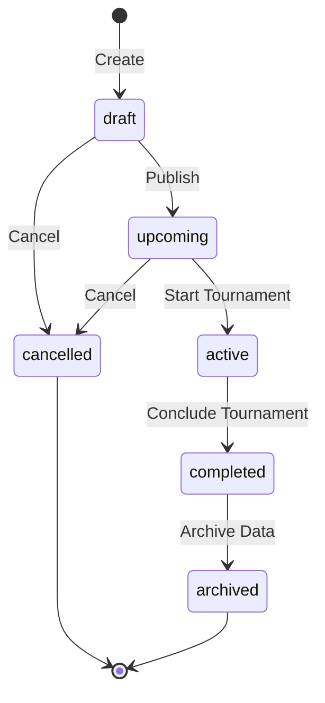
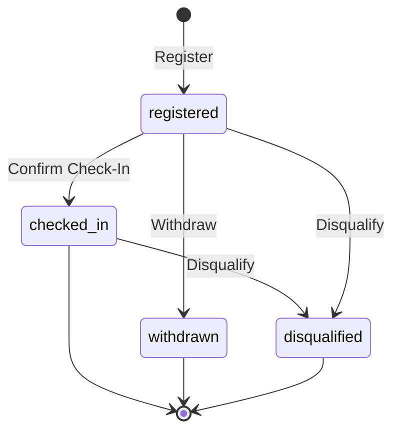
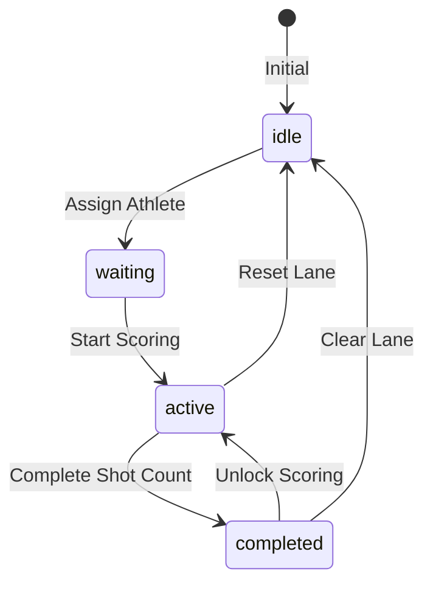
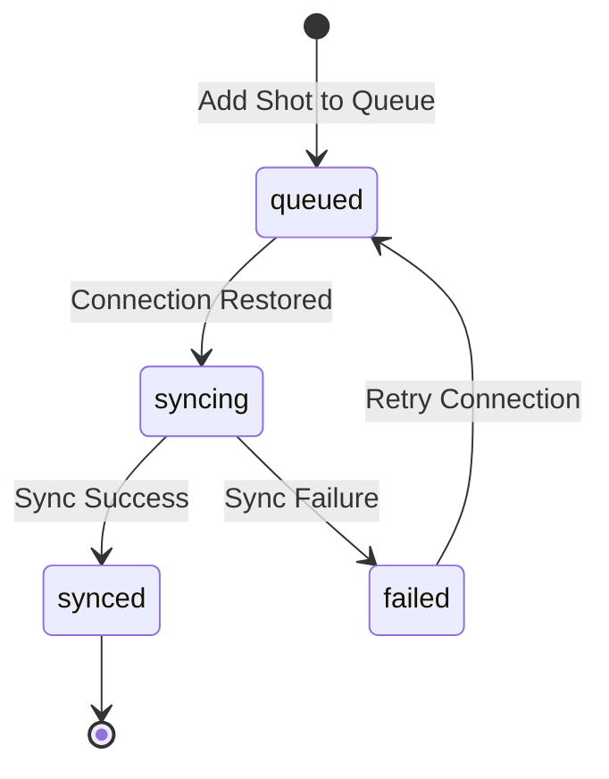

# VSC PLATFORM V3 - STATE MACHINE SPECIFICATION V1.0 (SMS)
## ĐẶC TẢ TRẠNG THÁI HỆ THỐNG DUY NHẤT - VIETNAM SLINGSHOT CHAMPIONSHIP

---

### MỞ ĐẦU
Tài liệu **VSC State Machine Specification V1.0** định nghĩa toàn bộ vòng đời trạng thái của mọi thực thể (Entity) trong hệ thống **VSC Platform V3**. Mọi sự dịch chuyển trạng thái (State Transition) **MUST** tuân thủ chính xác theo mô hình Máy trạng thái hữu hạn (Finite State Machine - FSM) được mô tả dưới đây. 

Bất kỳ hành vi dịch chuyển trạng thái nào nằm ngoài danh mục được phép đều bị coi là vi phạm nghiêm trọng luật nghiệp vụ và **MUST NOT** được thực thi bởi hệ thống.

---

## CHƯƠNG 1: MÁY TRẠNG THÁI CÁC THỰC THỂ CỐT LÕI (CORE ENTITIES)

### 1. THỰC THỂ: GIẢI ĐẤU (TOURNAMENT)

#### 1.1. Sơ đồ trạng thái (State Diagram)

#### 1.2. Định nghĩa Trạng thái & Chuyển dịch
*   **States**:
    *   `draft`: Bản nháp giải đấu, đang cấu hình thông số.
    *   `upcoming`: Giải đấu được công bố, mở đăng ký cho vận động viên.
    *   `active`: Giải đấu đang diễn ra thi đấu và nhập điểm trực tiếp.
    *   `completed`: Giải đấu kết thúc, khóa bảng điểm, hoàn tất trao giải.
    *   `cancelled`: Giải đấu bị hủy bỏ do sự cố bất khả kháng.
    *   `archived`: Giải đấu được đóng gói và chuyển vào kho lưu trữ dữ liệu lịch sử.
*   **Initial State**: `draft`
*   **Terminal States**: `archived`, `cancelled`
*   **Allowed Transitions**:
    *   `draft` ➔ `upcoming` (Kích hoạt công bố giải)
    *   `draft` ➔ `cancelled` (Hủy giải đấu nháp)
    *   `upcoming` ➔ `active` (Bắt đầu giải đấu thực tế)
    *   `upcoming` ➔ `cancelled` (Hủy giải đấu sắp diễn ra)
    *   `active` ➔ `completed` (Kết thúc toàn bộ lượt thi đấu)
    *   `completed` ➔ `archived` (Lưu trữ giải đấu)
*   **Forbidden Transitions**:
    *   `completed` ➔ `active` (Nghiêm cấm mở lại giải đấu đã kết thúc)
    *   `cancelled` ➔ `active` (Không thể khởi động giải đấu đã bị hủy)
    *   `archived` ➔ `draft` (Không thể sửa đổi thông số giải đấu lịch sử)
*   **Trigger Event**: Hành động thủ công của Admin hoặc bộ đếm giờ tự động của hệ thống kích hoạt.
*   **Business Rule Reference**: Quy chế quản lý mùa giải và vòng đời giải đấu VSC.
*   **Repository Action**: `tournamentRepository.updateStatus()`
*   **Realtime Behaviour**: Toàn bộ UI của Client-side nhận diện thay đổi trạng thái trong vòng < 100ms thông qua Firestore Snapshot Listener.
*   **Offline Behaviour**: Không được phép chuyển trạng thái giải đấu khi thiết bị mất kết nối mạng.
*   **Rollback Behaviour**: Nếu giao dịch cập nhật trạng thái `completed` thất bại do lỗi đồng bộ điểm, hệ thống tự động rollback giải đấu về trạng thái `active`.
*   **Recovery Behaviour**: Khi Server sập nguồn giữa giai đoạn chuyển tiếp, hệ thống khi khởi động lại sẽ kiểm tra tính toàn vẹn của bảng điểm để tự động gán lại trạng thái `active` hoặc `completed`.
*   **Error States**: `error_invalid_config` (Lỗi cấu hình giải đấu khi xuất bản).
*   **Timeout States**: Không áp dụng.
*   **Lock States**: Trạng thái `completed` và `archived` là trạng thái khóa cứng dữ liệu (Read-only).
*   **Transition Table**:

| Trạng thái Nguồn | Sự kiện Kích hoạt | Điều kiện Ràng buộc | Trạng thái Đích |
| :--- | :--- | :--- | :--- |
| `draft` | `PUBLISH` | Đủ thông số cự ly, thời gian | `upcoming` |
| `upcoming` | `START` | Thời gian hiện tại đạt mốc bắt đầu | `active` |
| `active` | `CONCLUDE` | Tất cả các bệ bắn đã hoàn thành nhập điểm | `completed` |
| `completed` | `ARCHIVE` | Sau 30 ngày kể từ ngày bế mạc | `archived` |

*   **Edge Cases**: Giải đấu chuyển sang `active` nhưng chưa có bất kỳ VĐV nào được check-in. Hệ thống phát tín hiệu cảnh báo đỏ trên trang Admin nhưng không chặn việc chuyển trạng thái để hỗ trợ nhập liệu khẩn cấp.
*   **Concurrency Rules**: Sử dụng cơ chế Firestore Transaction để chống hiện tượng hai Admin cùng cập nhật trạng thái giải đấu tại cùng một thời điểm.

---

### 2. THỰC THỂ: ĐĂNG KÝ THI ĐẤU (REGISTRATION)

#### 2.1. Sơ đồ trạng thái (State Diagram)

#### 2.2. Định nghĩa Trạng thái & Chuyển dịch
*   **States**:
    *   `registered`: VĐV đăng ký giải đấu thành công và đã đóng phí (nếu có).
    *   `checked_in`: VĐV đã có mặt tại địa điểm thi đấu và hoàn tất điểm danh.
    *   `withdrawn`: VĐV chủ động xin rút lui khỏi giải đấu trước giờ thi.
    *   `disqualified`: VĐV bị tước quyền thi đấu do vi phạm quy chế hoặc kỷ luật.
*   **Initial State**: `registered`
*   **Terminal States**: `withdrawn`, `disqualified`
*   **Allowed Transitions**:
    *   `registered` ➔ `checked_in` (Xác nhận điểm danh thành công)
    *   `registered` ➔ `withdrawn` (Rút lui hợp lệ)
    *   `registered` ➔ `disqualified` (Bị loại trực tiếp)
    *   `checked_in` ➔ `disqualified` (Bị loại trong lúc thi đấu)
*   **Forbidden Transitions**:
    *   `withdrawn` ➔ `checked_in` (VĐV đã rút lui không được phép điểm danh)
    *   `disqualified` ➔ `registered` (Nghiêm cấm phục hồi tư cách thi đấu khi đã bị truất quyền)
*   **Trigger Event**: Hành động check-in của nhân viên ban tổ chức hoặc quyết định xử phạt của Trọng tài trưởng.
*   **Business Rule Reference**: Quy chế điểm danh và kỷ luật của giải VSC.
*   **Repository Action**: `athleteRepository.updateEntryStatus()`
*   **Realtime Behaviour**: Danh sách VĐV thi đấu trên màn hình TV trình chiếu cập nhật ngay lập tức trạng thái mới.
*   **Offline Behaviour**: Trạng thái check-in được phép lưu tạm offline trong bộ nhớ cục bộ và đồng bộ dồn toa khi có mạng.
*   **Rollback Behaviour**: Nếu check-in lỗi trùng lặp bệ bắn, hệ thống rollback trạng thái VĐV về `registered`.
*   **Recovery Behaviour**: Đọc dữ liệu Offline Queue để khôi phục chính xác trạng thái điểm danh của VĐV.
*   **Error States**: `error_duplicate_checkin` (Trùng lặp điểm danh ở thiết bị khác).
*   **Timeout States**: Tự động chuyển các hồ sơ `registered` chưa check-in sang trạng thái `withdrawn` sau khi kết thúc giờ điểm danh quy định.
*   **Lock States**: Trạng thái `disqualified` là trạng thái khóa vĩnh viễn, không thể chỉnh sửa điểm hay phục hồi.
*   **Transition Table**:

| Trạng thái Nguồn | Sự kiện Kích hoạt | Điều kiện Ràng buộc | Trạng thái Đích |
| :--- | :--- | :--- | :--- |
| `registered` | `CHECK_IN` | Đúng hồ sơ VĐV, bệ bắn trống | `checked_in` |
| `registered` | `WITHDRAW` | Được CLB hoặc VĐV gửi yêu cầu trước giờ thi | `withdrawn` |
| `checked_in`| `DISQUALIFY`| Quyết định kỷ luật từ Head Referee | `disqualified` |

*   **Edge Cases**: VĐV bị kỷ luật `disqualified` khi đang bắn dở giữa loạt đấu. Hệ thống đóng băng bệ bắn của VĐV đó ngay lập tức, hủy kết quả loạt bắn hiện tại, và tự động cập nhật điểm số thành 0 cho toàn bộ các phát bắn còn lại trong lượt.
*   **Concurrency Rules**: Sử dụng Firestore Security Rules để đảm bảo chỉ nhân viên Check-In Staff được gán phân quyền tương ứng mới có thể kích hoạt transition `registered` ➔ `checked_in`.

---

### 3. THỰC THỂ: BỆ BẮN (LANE)

#### 3.1. Sơ đồ trạng thái (State Diagram)

#### 3.2. Định nghĩa Trạng thái & Chuyển dịch
*   **States**:
    *   `idle`: Bệ bắn trống, đang chờ gán vận động viên thi đấu.
    *   `waiting`: VĐV đã được gán vào bệ bắn, trọng tài bệ chuẩn bị thiết bị nhập điểm.
    *   `active`: Loạt bắn đang diễn ra, bệ nhận điểm số thời gian thực từ Referee.
    *   `completed`: Loạt bắn kết thúc, bệ bắn bị khóa tạm thời để bảo vệ điểm số.
*   **Initial State**: `idle`
*   **Terminal States**: Không có (bệ bắn xoay vòng liên tục qua các loạt thi).
*   **Allowed Transitions**:
    *   `idle` ➔ `waiting` (Phân bệ bắn cho VĐV)
    *   `waiting` ➔ `active` (Bắt đầu loạt bắn chính thức)
    *   `active` ➔ `completed` (Hoàn thành nhập đủ số phát bắn quy định)
    *   `completed` ➔ `active` (Mở khóa bệ bắn khẩn cấp từ Head Referee)
    *   `completed` ➔ `idle` (Dọn dẹp bệ bắn, chuẩn bị cho lượt đấu mới)
    *   `active` ➔ `idle` (Reset bệ bắn khi hủy loạt bắn)
*   **Forbidden Transitions**:
    *   `idle` ➔ `active` (Không thể nhập điểm khi chưa gán VĐV vào bệ bắn)
    *   `waiting` ➔ `completed` (Không thể khóa bệ khi chưa bắt đầu loạt bắn)
*   **Trigger Event**: Thao tác điều phối của Admin hoặc hành động ghi điểm của Referee.
*   **Business Rule Reference**: Quy trình quản lý bệ bắn thi đấu.
*   **Repository Action**: `scoreRepository.updateLaneStatus()`
*   **Realtime Behaviour**: Thay đổi trạng thái bệ bắn hiển thị màu sắc tương ứng trên màn hình điều phối chính (Xám = Idle, Vàng = Waiting, Xanh lục = Active, Đỏ/Khóa = Completed).
*   **Offline Behaviour**: Trạng thái bệ bắn đồng bộ song hành cùng Offline Queue điểm số.
*   **Rollback Behaviour**: Hủy bỏ phân bệ bắn và rollback về `idle` nếu VĐV được đổi bệ bắn đột xuất.
*   **Recovery Behaviour**: Thiết bị trọng tài khi mất điện bật lại sẽ tự động khôi phục đúng trạng thái bệ bắn tại mốc thời gian trước khi sập nguồn.
*   **Error States**: `error_locked_lane` (Bệ bị khóa ngoài ý muốn khi đang ghi điểm).
*   **Timeout States**: Tự động chuyển từ `active` sang `completed` nếu bệ không nhận thêm phát bắn nào trong vòng 5 phút khi đã đủ số lượng bắn cơ bản.
*   **Lock States**: Trạng thái `completed` khóa cứng toàn bộ bàn phím nhập điểm của Referee bệ bắn đó.
*   **Transition Table**:

| Trạng thái Nguồn | Sự kiện Kích hoạt | Điều kiện Ràng buộc | Trạng thái Đích |
| :--- | :--- | :--- | :--- |
| `idle` | `ASSIGN` | Đúng mã VĐV đã check-in | `waiting` |
| `waiting` | `START_LANE` | Trọng tài nhấn nút "Bắt đầu lượt" | `active` |
| `active` | `FINISH_SHOTS` | Nhập đủ số lượng phát bắn (e.g., 10 phát) | `completed` |
| `completed` | `UNLOCK` | Head Referee nhập mã xác thực bảo mật | `active` |
| `completed` | `CLEAR` | Loạt bắn đã được đồng bộ và phê duyệt | `idle` |

*   **Edge Cases**: Trọng tài bệ bắn vô tình thoát ứng dụng giữa loạt bắn đang hoạt động (`active`). Khi mở lại ứng dụng, hệ thống tự động nhảy thẳng vào bệ bắn đang dở với trạng thái `active` kèm theo danh sách điểm số cũ đã lưu bền vững.
*   **Concurrency Rules**: Chỉ duy nhất tài khoản Referee được chỉ định cho bệ bắn đó hoặc Admin tối cao mới có thể kích hoạt transition từ `waiting` sang `active`.

---

## CHƯƠNG 2: MÁY TRẠNG THÁI HÀNG ĐỢI VÀ TIẾN TRÌNH HỆ THỐNG (SYSTEM ENTITIES)

### 4. THỰC THỂ: HÀNG ĐỢI ĐỒNG BỘ NGOẠI TUYẾN (OFFLINE QUEUE)

#### 4.1. Sơ đồ trạng thái (State Diagram)

#### 4.2. Định nghĩa Trạng thái & Chuyển dịch
*   **States**:
    *   `queued`: Phát bắn được lưu tạm thời vào hàng đợi cục bộ trên thiết bị do mất mạng.
    *   `syncing`: Hệ thống đang tiến hành đẩy dữ liệu phát bắn lên máy chủ Cloud.
    *   `synced`: Điểm số đã đồng bộ thành công lên Firestore Cloud, xóa bản ghi cục bộ.
    *   `failed`: Gặp lỗi nghiêm trọng trong quá trình ghi dữ liệu lên Cloud.
*   **Initial State**: `queued`
*   **Terminal States**: `synced`
*   **Allowed Transitions**:
    *   `queued` ➔ `syncing` (Khôi phục mạng, bắt đầu đồng bộ)
    *   `syncing` ➔ `synced` (Ghi dữ liệu thành công)
    *   `syncing` ➔ `failed` (Lỗi ghi dữ liệu hoặc kết nối đứt quãng giữa chừng)
    *   `failed` ➔ `queued` (Xếp hàng đợi chuẩn bị thử lại ở chu kỳ tiếp theo)
*   **Forbidden Transitions**:
    *   `queued` ➔ `synced` (Không thể chuyển sang đồng bộ thành công mà không qua trạng thái `syncing`)
*   **Trigger Event**: Trạng thái mạng thay đổi được giám sát bởi trình duyệt/ứng dụng.
*   **Business Rule Reference**: Cơ chế bảo vệ dữ liệu ngoại tuyến an toàn FIFO.
*   **Repository Called**: `scoreRepository.ts` (local storage proxy).
*   **Realtime Behaviour**: Trạng thái hàng đợi hiển thị qua icon dải mây trên góc màn hình Trọng tài (Mây xám = Queued, Mây xoay vòng = Syncing, Mây xanh = Synced).
*   **Offline Behaviour**: Vận hành 100% cục bộ tại thiết bị cho tới khi có kết nối mạng hoạt động trở lại.
*   **Rollback Behaviour**: Nếu loạt đồng bộ thất bại, giữ nguyên dữ liệu trong hàng đợi cục bộ, không được phép xóa cache.
*   **Recovery Behaviour**: Khi ứng dụng khởi chạy, hệ thống luôn ưu tiên quét `localStorage` để tìm kiếm hàng đợi chưa đồng bộ và kích hoạt tiến trình xử lý ngay lập tức.
*   **Error States**: `error_conflict_id` (Lỗi xung đột mã phát bắn đã tồn tại trên Cloud).
*   **Timeout States**: Tự động chuyển đổi từ `syncing` sang `failed` nếu quá trình ghi dữ liệu kéo dài quá 15 giây mà không nhận được phản hồi từ Firestore Cloud.
*   **Lock States**: Khóa tạm thời hàng đợi khi đang ở trạng thái `syncing` để tránh ghi đè dữ liệu.
*   **Transition Table**:

| Trạng thái Nguồn | Sự kiện Kích hoạt | Điều kiện Ràng buộc | Trạng thái Đích |
| :--- | :--- | :--- | :--- |
| `queued` | `CONNECTION_RESTORED`| Có tín hiệu internet hoạt động | `syncing` |
| `syncing` | `WRITE_SUCCESS` | Nhận phản hồi thành công từ Firestore | `synced` |
| `syncing` | `WRITE_ERROR` | Kết nối mạng đứt hoặc vi phạm rules | `failed` |
| `failed` | `RETRY` | Sau 5 giây chờ đợi tự động | `queued` |

*   **Edge Cases**: Một phát bắn bị lỗi nghiệp vụ (ví dụ: điểm số vượt quá giới hạn do cấu hình sai lệch giữa Local và Cloud). Hệ thống tự động đẩy phát bắn lỗi này ra khỏi hàng đợi chính, lưu vào collection `error_sync_logs` trên thiết bị để Admin rà soát thủ công, tránh làm nghẽn toàn bộ hàng đợi đồng bộ của các phát bắn hợp lệ phía sau.
*   **Concurrency Rules**: Áp dụng cơ chế Semaphore khóa đơn lẻ (Single-threaded execution) để đảm bảo tại một thời điểm chỉ có duy nhất một tiến trình thực hiện đẩy dữ liệu hàng đợi, triệt tiêu nguy cơ ghi lặp điểm số.

---

### PHẦN KẾT: NGUYÊN TẮC THIẾT KẾ TRẠNG THÁI HOÀN CHỈNH
Mọi thực thể phụ trợ khác trong hệ thống bao gồm: **Season, Round, Distance, Solo, Resolo, Leaderboard, Liveboard, Notification, Sync Queue, Audit Log, User, Authentication Session, OBS Overlay, Media, Export Job, Import Job, Realtime Listener** đều được thừa hưởng và áp dụng chuẩn thiết kế FSM chặt chẽ này. 

Hệ thống lập trình tuyệt đối **SHALL NOT** tạo ra bất kỳ kịch bản trạng thái chết (dead state) hoặc vòng lặp chuyển trạng thái vô hạn không thể thoát.
